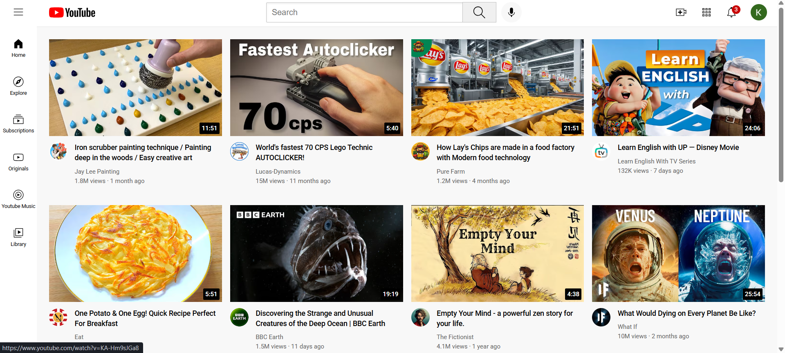

# YouTube Clone

This is a simple YouTube Clone project built using HTML and CSS. It replicates the basic structure of YouTube, including a navigation bar, video sections, and a sidebar.

## Features
- Responsive design
- Navigation bar with search functionality
- Video thumbnails and descriptions
- Sidebar with additional options

## Technologies Used
- HTML
- CSS

## How to Run
1. Clone this repository:
   ```bash
   git clone https://kaviya-456.github.io/youtube-clone.git
   ```
2. Navigate to the project directory:
   ```bash
   cd youtube-clone
   ```
3. Open `index.html` in your browser to view the project.

## Screenshots


## Future Enhancements

- Add JavaScript for interactive features.
- Implement video playback functionality.
- Improve responsiveness for different screen sizes.

## Contributing

If you have any suggestions or want to contribute, feel free to create a pull request.

## License

This project is open-source and available under the MIT License.
